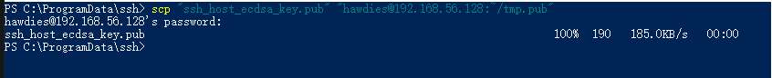

# ubuntu安装后,相关初始化工作

## 换源

将原`/etc/apt/sources.list`,通过命令`mv /etc/apt/sources.list /etc/apt/sources.list.bak`备份,再写入新的国内源.
通过命令`sudo apt update`和命令`suao apt upgrade`进行更新.

## 进行远程连接设置

安装ssh,通过命令`sudo apt install openssh-server`.再通过`sudo /etc/init.d/ssh start`或者`sudo service ssh start`启动服务.
可以通过命令`ps -e|grep ssh`查看是否启动了服务.此时可以通过xshell进行远程连接.

### 配置vscode通过remote-ssh插件进行远程连接ubuntu

1. 现在本机(比如win10)安装openssh,[安装地址及教程见](https://github.com/PowerShell/Win32-OpenSSH/wiki/Install-Win32-OpenSSH).
将openssh安装到`C:\Program Files\OpenSSH`,然后运行powershell,执行命令`powershell.exe -ExecutionPolicy Bypass -File install-sshd.ps1`,
会在`%programdata%\ssh`生成密钥.再运行命令`net start sshd`启动ssh服务.  
卸载ssh:`cd 'C:\Program Files\OpenSSH'`再执行`powershell.exe -ExecutionPolicy Bypass -File uninstall-sshd.ps1`  
2. [在远程ubunt安装本机中的公钥教程](https://code.visualstudio.com/docs/remote/troubleshooting).  
在`%programdata%\ssh`目录下找到`ssh_host_ecdsa_key.pub`复制到ubuntu中.

   - 方法一:

   ```text
   $REMOTEHOST="your-user-name-on-host@host-fqdn-or-ip-goes-here"

   scp "$env:USERPROFILE\.ssh\ssh_host_ecdsa_key.pub" "${REMOTEHOST}:~/tmp.pub"
   ssh "$REMOTEHOST" "mkdir -p ~/.ssh && chmod 700 ~/.ssh && cat ~/tmp.pub >> ~/.ssh/authorized_keys && chmod 600 ~/.ssh/authorized_keys && rm -f ~/tmp.pub"
   ```

    运行结果如下:  
   

   - 方法二:直接将`ssh_host_ecdsa_key.pub`复制到ubuntu中,或者通过xftp复制过去.后续命令与上一致.

3. vscode安装remote-ssh插件.编辑配置文件,通过`ctrl+shfit+p`打开命令行,输入`remotessh:open configuration file`,打开`C:\ProgramData\ssh\ssh_config`,输入配置信息.
   示例如下:

   ```config
   Host hawdies
       HostName 192.168.56.128
       User hawdies
       IdentityFile C:/ProgramData/ssh/ssh_host_ecdsa_key
   ```

    若连接报错,则在插件中启用`Remote.SSH:Show Login Terminal`

此时就可以通过vscode进行远程访问ubuntu.

## 代理相关设置

### 先安装shadowsocks

[安装链接](https://github.com/shadowsocks/shadowsocks/tree/master),由于墙的限制,建议手动安装,
现在下来后通过`python setup.py install`命令安装成功后,在/etc/shadowsocks/config.json编辑配置文件.

```json
//模板
{
	"server": "45.32.18.100",
	"server_port": 8888,
	"local_address": "127.0.0.1",
	"local_port": 1080,
	"password":"fek9arb9",
	"timeout":300,
	"method": "aes-128-gcm"
}

```

启动服务`sslocal -c /etc/shadowsocks/config.json start`  
**设置开机自启动:** 新建`/etc/rc.loacl`输入:

```text
#!/bin/sh -e

nohup sslocal -c /etc/shadowsocks/config.json &

exit 0
```

### 设置全局终端代理

只在当前终端生效
export ALL_PROXY=socks5://127.0.0.1:1080

写入配置文件,在.bashrc文件中写入:
`export ALL_PROXY=socks5://127.0.0.1:1080`
然后在终端运行`source ~/.bashrc`即可启动终端代理.

### 配置谷歌浏览器访问外网

安装浏览器,`dpkg -i **.deb`.(**.deb是下载的谷歌浏览器安装包)
启动shadowsocks服务.
安装proxychains,`apt install proxychains`.
在安装proxychains, `apt install proxychains4`.(以后可以通过`proxychains4 command`)在终端访问外网.
创建配置文件`mkdir ~/.proxychains/ && touch proxychains.conf`.
在配置文件写入:

```text
strict_chain
proxy_dns
remote_dns_subnet 224
tcp_read_time_out 15000
tcp_connect_time_out 8000
localnet 127.0.0.0/255.0.0.0
quiet_mode

[ProxyList]
socks5  127.0.0.1 1080
```

运行`proxychains google-chrome`,此时可以通过谷歌浏览器访问外网.
先下载`SwitchyOmega`插件,配置代理.以后则不需proxychains命令.

### 此时可以下载vim插件

[vimrc插件链接](https://github.com/amix/vimrc)

```command
proxychains4 git clone --depth=1 https://github.com/amix/vimrc.git ~/.vim_runtime
sh ~/.vim_runtime/install_awesome_vimrc.sh
```

`proxychains4 git clone`通过走代理可以加速下载,国内若只用`git clone`下载由于网速问题很可能会失败.
